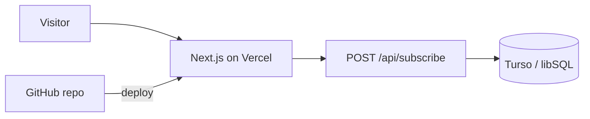

# Jivana — an AI-built Indian wellness storefront

Jivana is a responsive teaching project for a modern Indian pantry shop. It presents Sooth (dry ginger), Pepramul (ganthoda), Ajma (carom seeds), and Variyali (fennel) with product search, a bag counter, and a newsletter form backed by persistent SQLite-compatible storage.

> Educational concept only. Product descriptions describe culinary tradition, not medical advice.

## What is included

- Next.js 16 App Router and React 19
- Responsive and accessible editorial storefront
- Original AI-generated hero photography
- Search, mobile navigation, bag feedback, and newsletter states
- `/api/subscribe` using Turso/libSQL
- Vercel-ready framework defaults
- This complete AI → GitHub → Vercel lesson

## The important architecture decision

Vercel Functions do not offer a durable local filesystem. A SQLite file written inside a deployed function can disappear when an instance is recycled, and different instances do not share it.

The production-safe interpretation of “persistent SQLite on Vercel” is **Turso/libSQL**. It keeps SQLite semantics and uses a SQLite-compatible protocol while storing data durably outside the function. Local development can still use a literal file with `TURSO_DATABASE_URL=file:local.db`.



## Quick start

Prerequisites: Node 22+, Git, GitHub, Vercel, and an optional free Turso database.

```bash
npm install
cp .env.example .env.local
npm run dev
```

Open `http://localhost:3000`. For a local SQLite file, use:

```dotenv
TURSO_DATABASE_URL=file:local.db
NEXT_PUBLIC_SITE_URL=http://localhost:3000
```

The local database is ignored by Git. Before deploying, replace this with the hosted Turso URL and token.

## Lesson: ask AI to build the whole project

### 1. Start with a complete brief

Describe the business, audience, content, visual feeling, key functions, constraints, and finish line. Treat other sites as inspiration—not something to clone.

```text
Build a premium online Indian wellness pantry for U.S. customers.

Purpose: make hard-to-find Indian culinary botanicals easy to understand and use. Feature Sooth (dry ginger), Pepramul (ganthoda), Ajma (carom seeds), and Variyali (fennel). Emphasize raw, natural sourcing without making medical promises.

Visual direction: modern Indian editorial, deep forest green, turmeric gold, clay, and warm cream. Use purposeful food photography, excellent typography, generous whitespace, and tactile product cards. Responsive and accessible.

Functionality: product search, add-to-bag interaction, mobile menu, newsletter signup, and persistent SQLite-compatible storage. Deploy on Vercel's free plan. Put the project in GitHub and write a complete lesson showing how it was made.

References for information architecture and merchandising patterns:
- https://thedesifood.com/collections/mouth-freshener
- https://www.desiclik.com/mukhwas-mouth-freshener.html
- https://vamukh.com/

Implement, validate, publish to GitHub, and deploy to Vercel. Explain platform constraints honestly and choose the closest production-safe solution.
```

Why it works: this prompt defines the outcome, brand voice, exact products, interactions, technical requirements, and “done.”

### 2. Give AI the right capabilities

In Codex, capabilities come from skills, plugins, connected apps, and local tools. Names change, so describe the job when an exact capability is unavailable.

| Need | Capability | Job |
| --- | --- | --- |
| Site | Sites building / Next.js | Layout, content, responsiveness, interactions |
| Imagery | Image generation | One art-directed hero when stock is not distinctive |
| Hosting | Vercel deployment | Link, deploy, inspect, return live URL |
| Data | Vercel storage + Turso/libSQL | Durable SQLite-compatible records |
| Source | GitHub | Repository, commits, push, review |
| QA | Browser verification | Desktop/mobile and interaction checks |

Helpful follow-up:

```text
Use the site-building, image, GitHub, and Vercel capabilities available. Verify the result in a browser. Keep credentials out of the repository.
```

### 3. Force an honest storage decision

```text
Before implementing storage, explain whether a local SQLite file is durable on Vercel Functions. If not, use a free SQLite-compatible hosted option and document local and production setup.
```

A strong agent should reject `/tmp` as “persistent” and recommend a hosted SQLite-compatible database such as Turso/libSQL.

### 4. Use outcome-based checkpoints

```text
Continue until the production build passes. Test desktop and mobile layouts, product search, mobile navigation, add-to-bag feedback, and success/failure states of signup.
```

```text
Review the copy for health-claim risk. Rewrite promises to diagnose, treat, cure, or prevent conditions. Preserve culinary-wellness positioning.
```

```text
Inspect the Git diff before committing. Exclude secrets, local databases, build output, and unrelated files.
```

### 5. Configure persistent SQLite-compatible storage

Create a free database using current instructions at [Turso](https://turso.tech/). Copy `.env.example` to `.env.local`:

```dotenv
TURSO_DATABASE_URL=libsql://your-database.turso.io
TURSO_AUTH_TOKEN=your-secret-token
NEXT_PUBLIC_SITE_URL=https://your-project.vercel.app
```

The API creates this table on the first valid signup:

```sql
CREATE TABLE IF NOT EXISTS subscribers (
  id INTEGER PRIMARY KEY AUTOINCREMENT,
  email TEXT NOT NULL UNIQUE,
  created_at TEXT NOT NULL DEFAULT CURRENT_TIMESTAMP
);
```

Add the same values under Vercel → Project → Settings → Environment Variables. Never commit them.

### 6. Publish to GitHub

For a new private repository:

```bash
git init
git add .
git commit -m "Build Jivana wellness storefront"
gh repo create jivana-indian-wellness --private --source=. --remote=origin --push
```

For a branch and draft pull request in an existing repo:

```bash
git switch -c agent/jivana-storefront
git add app lib public .env.example README.md package.json package-lock.json
git commit -m "Build Jivana wellness storefront"
git push -u origin agent/jivana-storefront
gh pr create --draft --fill
```

AI prompt:

```text
Publish this as a private GitHub repository named jivana-indian-wellness. Inspect the working tree and .gitignore first. Commit only the finished site, lesson, lockfile, and safe configuration. Never commit .env files, tokens, or local database files.
```

### 7. Deploy on Vercel Free

Vercel detects Next.js automatically:

```bash
vercel
# after preview verification
vercel --prod
```

Alternatively import the GitHub repository in Vercel for automatic preview deployments and production deploys from the chosen branch.

AI prompt:

```text
Deploy this project to my logged-in Vercel account on the free plan. Use Next.js defaults. Add the Turso variables to Preview and Production without exposing them. Verify a 200 response and confirm a test signup persists.
```

### 8. Definition of done

- Production build passes.
- Phone, tablet, and desktop layouts work.
- Navigation is keyboard-usable.
- Search filters products and has an empty state.
- Bag count updates.
- Signup validates emails and tolerates duplicates.
- Production data remains after redeploy.
- No secrets or local database files are in Git.
- GitHub and Vercel URLs are returned.
- Wellness copy is framed as culinary tradition with a disclaimer.

## Project map

```text
app/
  api/subscribe/route.ts   newsletter API
  globals.css              responsive visual system
  layout.tsx               fonts and social metadata
  page.tsx                 route entry
  storefront.tsx           interactive storefront
lib/db.ts                  lazy libSQL client
public/hero-botanicals.jpg original hero art
.env.example               environment template
```

## Useful next prompts

```text
Add product detail pages with ingredients, preparation ideas, sourcing notes, and structured product metadata. Preserve the visual system.
```

```text
Replace the demo bag with Stripe Checkout. Keep prices server-side, validate quantities, add a webhook, and document test mode before live payments.
```

```text
Add an owner-only subscriber admin page. Protect it with authentication and never expose the Turso token to browser code.
```

```text
Create GitHub Actions that run the production build on pull requests. Let Vercel handle preview deployments through Git integration.
```

## Safety before a real launch

- Have final health and product copy reviewed for every market where you sell.
- Add shipping, returns, privacy, terms, contact, allergen, and origin information.
- Do not reuse competitor photos or copy; references should guide only structure and expectations.
- Add payments only after prices, tax, fulfillment, refunds, and webhook behavior are decided.

## Image-generation record

The built-in image generator created the hero from an art-directed prompt: amber jars and clay bowls containing dry ginger, ganthoda powder, and ajwain seeds; forest-green backdrop; warm stone; editorial morning light; no text, labels, people, medical props, or watermark.

## Troubleshooting field notes from this build

This section records the actual problems encountered while publishing this project. It is intentionally practical: check each layer separately instead of treating “the deploy failed” as one problem.

### 1. A local commit is not a GitHub push

Symptom: `git log` shows a commit, but GitHub has no repository or files.

Diagnosis:

```bash
git status --short --branch
git remote -v
git log -1 --oneline
```

If `git remote -v` is empty, create the GitHub repository without a README, license, or `.gitignore`, then connect and push it:

```bash
git remote add origin https://github.com/YOUR-NAME/jivana-indian-wellness.git
git branch -M main
git push -u origin main
```

AI prompt:

```text
Verify whether this folder is committed locally, connected to a GitHub remote, and actually pushed. Do not say “published” until you can read the remote repository and confirm its default branch.
```

### 2. Chrome login and command-line Git login are different

Symptom: GitHub works in Chrome, but `git push` says it cannot read a username or the GitHub CLI reports an invalid token.

Why: browser cookies, GitHub Desktop credentials, the Git credential helper, and `gh` authentication are separate credential stores.

Safe recovery:

```bash
gh auth status
gh auth login --hostname github.com --git-protocol https --web
```

Complete the device authorization in the already signed-in browser. If Git still does not use the new login, configure the repository to use GitHub CLI as its credential helper:

```bash
git config --local credential.https://github.com.helper ''
git config --local --add credential.https://github.com.helper '!gh auth git-credential'
git push -u origin main
```

Never paste a personal access token into chat, source files, shell history, or screenshots. Passkeys, passwords, and 2FA must be completed by the account owner.

### 3. A Vercel project can be deployed but not connected to Git

Symptom: Vercel shows a Ready production deployment, but its Source says `vercel deploy`, and the project overview still offers **Connect Git**.

Fix:

1. Push the repository to GitHub first.
2. Open Vercel → Project → Settings → Git.
3. Choose GitHub, search for the exact repository, and click **Connect**.
4. Verify that Settings → Git shows `owner/repository` and “Connected”.

Connecting after the original commit may not start a build. Trigger a harmless empty commit once:

```bash
git commit --allow-empty -m "Trigger Vercel Git deployment"
git push origin main
```

The new Vercel deployment should identify GitHub as its source and show the branch and commit SHA.

### 4. Verify the build, deployment, domain, and HTTP response independently

A green build is only one layer. Check all four:

1. Build logs finish with `Deployment completed` and list the expected routes, including `/`.
2. Deployment state is `READY`.
3. The production alias is attached to the newest deployment with no alias error.
4. A real request to the public URL returns the page, not a Vercel platform error.

Useful commands:

```bash
curl -i https://YOUR-PROJECT.vercel.app/
vercel inspect https://YOUR-DEPLOYMENT.vercel.app
vercel alias ls
```

Useful Vercel MCP sequence:

```text
1. list_projects to resolve the project ID
2. get_project to inspect domains and the latest deployment
3. list_deployments or get_deployment to verify READY, source, aliases, and aliasError
4. get_deployment_build_logs to confirm the Next.js routes were emitted
5. web_fetch_vercel_url to test the response through Vercel-aware access
6. search_vercel_documentation for the exact error header and state combination
```

AI prompt:

```text
Use the Vercel MCP, not assumptions. Inspect the project, latest deployment, aliases, build logs, and a real HTTP fetch. Report which layer failed: source connection, build, deployment state, alias assignment, deployment protection, or application runtime.
```

### 5. Ready deployment plus `x-vercel-error: NOT_FOUND`

Observed symptom: Vercel reported `READY`, the Next.js build emitted `/`, the production domain showed **Valid Configuration**, and deployment metadata listed the expected aliases—yet the public URL returned a platform-level 404 with `x-vercel-error: NOT_FOUND`.

Resolution in this project: the Root Directory was already correct. The app's `package.json`, `app/`, `public/`, and `next.config.ts` all live at repository root, so Vercel's Root Directory field should be left empty (the UI placeholder is `./`). The actual fault was **Framework Preset = Other**. Vercel could execute `npm run build`, but the project metadata remained `framework: null`, and every alias returned the platform 404. Changing Project → Settings → Build and Deployment → Framework Preset to **Next.js**, leaving Build Command and Output Directory on Next.js defaults, saving, and triggering a fresh Git deployment changed the MCP result to `framework: "nextjs"`. The production URL then returned HTTP 200 with `x-matched-path: /`.

The verified settings are:

```text
Framework Preset: Next.js
Root Directory:   empty (repository root / ./)
Build Command:    Next.js default
Output Directory: Next.js default
Install Command:  automatic
```

Do not set Root Directory to `/`, `app`, or another guessed folder for this repository. `app/` is a Next.js routing directory, not a standalone deployable frontend root; `package.json` must remain visible from the configured project root.

This is different from an application 404. An application 404 usually renders the app's own not-found page and reaches runtime or static output. A platform `NOT_FOUND` arrives directly from Vercel before the app runs.

Diagnostic checklist:

- Confirm the URL belongs to the intended team and project.
- Confirm the newest production deployment is current and not paused.
- Confirm `target` is `production`, `readyState` is `READY`, and `aliasError` is null.
- Confirm the alias array includes the expected production hostname.
- Confirm build logs include the root route `/`.
- Check Deployment Protection separately.
- Re-save the production domain mapping to the Production environment to force alias reassignment.
- If metadata and the edge response still contradict each other, preserve the deployment ID and `x-vercel-id` and escalate to Vercel Support; that evidence points to platform routing rather than site code.

According to Vercel's documentation, aliases can be reassigned explicitly:

```bash
vercel alias set YOUR-DEPLOYMENT.vercel.app YOUR-PROJECT.vercel.app
```

Do not repeatedly rewrite application routes to fix a platform-level alias 404 when the build logs already prove `/` exists.

### 6. Deployment Protection can hide an otherwise healthy site

Symptom: visitors must log into Vercel, receive a protected response, or cannot open a public storefront.

Check Project → Settings → Deployment Protection. For a public shop, **Require Log In** should be off. Disabling it materially expands access, so the project owner should explicitly approve the change. After saving, test the public URL from a signed-out browser or with `curl`.

Vercel's documented API representation is:

```json
{
  "ssoProtection": null
}
```

### 7. `favicon.ico` returning 404

Symptom: the browser console reports `/favicon.ico:1 Failed to load resource: 404` while the page itself works.

Impact: cosmetic only. It does not mean the deployment failed. Add `app/icon.png`, `app/icon.svg`, or `app/favicon.ico` in a Next.js App Router project, commit it, and let the Git-connected Vercel project redeploy.

### 8. Persistent SQLite on Vercel

Do not use a file such as `data.sqlite` for durable production writes on Vercel Functions. The function filesystem is ephemeral and may differ between instances. Use a SQLite-compatible hosted service such as Turso/libSQL and supply its URL and token through Vercel environment variables. Local file SQLite is acceptable only as a development fallback.

### 9. Evidence to save before asking for help

Record these values without exposing secrets:

- GitHub repository URL, branch, and commit SHA.
- Vercel team ID, project ID, deployment ID, and deployment URL.
- Deployment `readyState`, `target`, source, aliases, and `aliasError`.
- The final build-log lines and generated route list.
- HTTP status, `x-vercel-error`, and `x-vercel-id`.
- Whether Deployment Protection is enabled.

That evidence lets an AI assistant or Vercel Support distinguish a code problem from an authentication, Git connection, alias, or edge-routing problem quickly.

## License

Use the code as a learning project. Confirm rights for names, claims, photographs, and packaging before commercial use.
